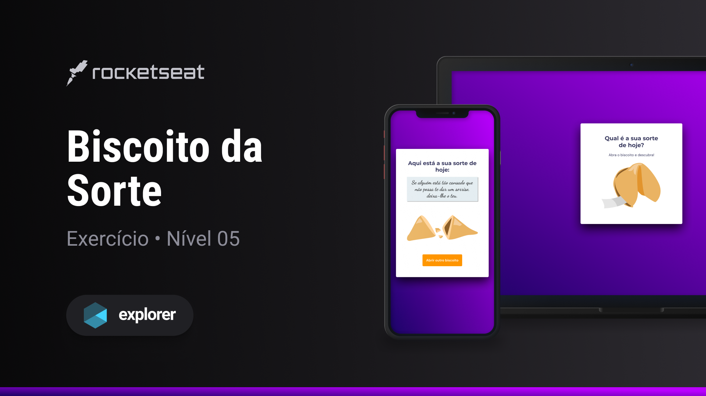

<h1 align="center">Biscoito da Sorte</h1>

Explorer | Stage 05 - Biscoito da Sorte

  <a href="#-tecnologias">Tecnologias</a>&nbsp;&nbsp;&nbsp;|&nbsp;&nbsp;&nbsp;
  <a href="#-projeto">Projeto</a>&nbsp;&nbsp;&nbsp;|&nbsp;&nbsp;&nbsp;
  <a href="#-licença">Licença</a>&nbsp;&nbsp;&nbsp;|&nbsp;&nbsp;&nbsp;

  

 

  

## 🚀 Tecnologias

Esse projeto foi desenvolvido com as seguintes tecnologias:

- HTML
- CSS
- JS

## 💻 Projeto (desafio)

Este é um desafio proposto no no curso Explorer da [Rocketseat](https://www.rocketseat.com.br/). Que, basicamente, consiste em um biscoito da sorte virtual.

Alguns dos conceitos aplicados ao projeto em questão:

- HTML
  - Tags semânticas

- CSS:
  - Grid
  - Animation
  - Transition
  - Variáveis

- JS:
  - Funções
  - Manipulando a DOM
  - Ouvindo Eventos da DOM
  - Variáveis
  - Objetos
  - Validação
  - Responsabilidade de camadas (Arquitetura de software)
  - Factory pattern
  - Inversão de dependências
  - FetchAPI

- Extra:
  - Frases fornecidas por uma API externa
  - Animações adicionais

## 📝 Licença

Esse projeto está sob a licença MIT.